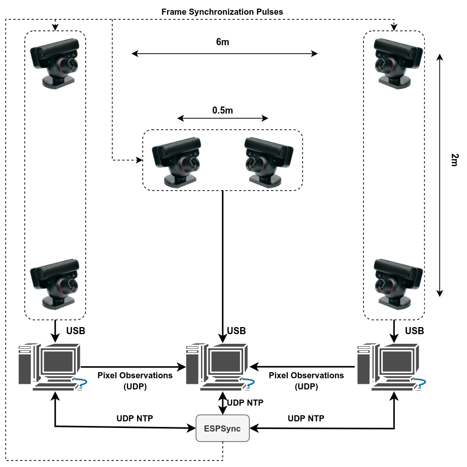
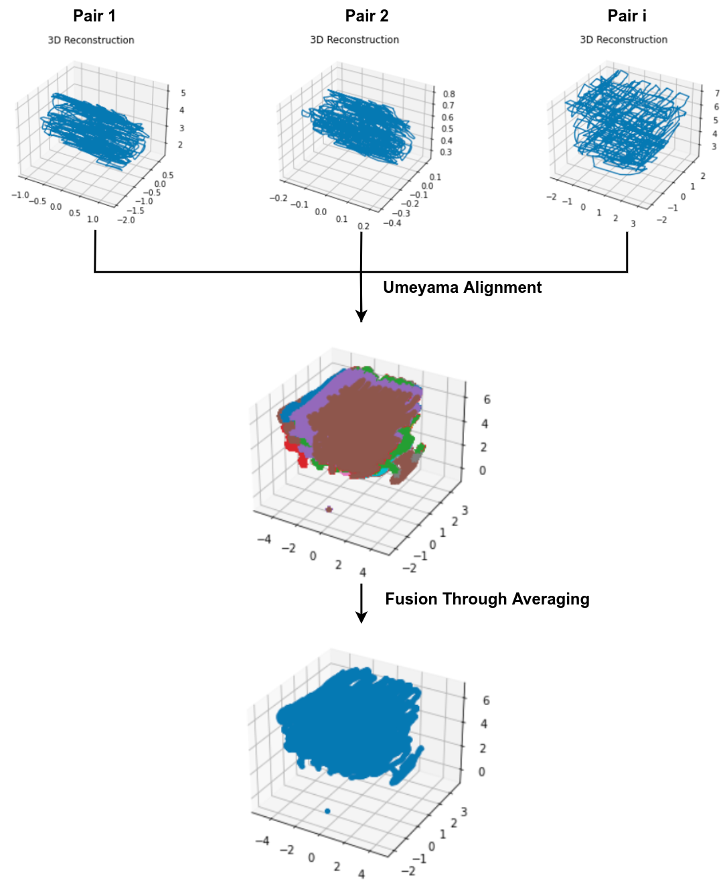
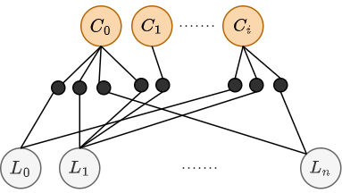

# Multi-Camera Calibration and Tracking (3D)

This tutorial focuses on the procedure of setting up a system comprised of several cameras that observe a single IR marker from various perspectives and track its 3D position in space. 

## Setup
The camera layout of the example configuration is shown below. As it can be seen, the system is comprised of six PS3-eye cameras installed on four corners of a rectangle space and two extra cameras installed on the ceiling and center of the rectangle and looking downwards. 

  

The system architecture of this example is also shown in the image. The six PS3-eye cameras are synchronized using our ESPSync trigger generator and NTP server. Two pairs of cameras on the two sides of the rectangular workspace are attached to independent computers, and the stereo camera on the roof is attached to the server PC. These PCs and the ESPSync board are connected using an ethernet switch and all are synchronized against the ESPSync's clock through continuously running NTP daemons. 

## Calibration

Before we can track the 3D position of our robots (marker), we need to have the relative poses of the cameras in the system. To do so, first, we need to collect a calibration dataset. This dataset contains the movement of a single marker in front of the cameras at various locations and is recorded by the *udp_aggregator_node* as explained in [here](link). 

### Theory of Operation

During the calibration, we rely on the epipolar geometry between pairs of cameras to define constraining matrices and then, geometrical transformations that define the relative configuration of the cameras with respect to each other. As shown in the following image from the [Multi-View Geometry Book](https://www.amazon.com/Multiple-View-Geometry-Computer-Vision/dp/0521540518), the epipolar constraint relates the pixel position of a marker observed from two poses (or two distinct cameras). 

This constraint is expressed through the following equation:

$${x^\prime}^T F x =0$$

Where $F$ is a rank-2 $3\times3$ fundamental matrix. The fundamental matrix is related to the essential matrix $E$ as follows:

$$E = {K_1}^TFK_2$$

where $K_i$ are the camera matrices found during the [calibration and setup procedure](). The essential matrix relates the normalized pixel observations and is made up of the geometrical transformation $[R|T]$ between the two cameras as follows:

$$E =[T]_{\times}R$$

where $[.]_{\times}$ is the skew-symmetric representation of a matrix as defined [here](). To decompose $R$ and $T$ from $E$ we use the following procedure:

- Compute the SVD decomposition of $E=USV^T$

- Compute $R = UWV^T$ and $T$ as the last column of $U$. 

- Triangulated the undistorted observed marker using the estimated $[R|T]$, and camera matrices $K1, K2$ to get a candidate 3D position $P$. 

- If the triangulated point is at the back of one of the cameras ($P_1^z \times P_2^z<0$ where $P1 = P, P2 = [R|T] \times P$), recompute R as $R = UW^TV^T$

- Triangulate again using the newly computed R or the old one (if the previous step was not required). If the triangulated point is at the back of the second camera ($P2<0$>), take $T$ as $T=-T$.

For each camera pair in the system, we carry out this decomposition to find the extrinsic parameters (relative poses) of all camera pairs. Using these parameters, the camera intrinsic parameters, and undistorted pixel observations of each pair we compute one point cloud per each camera pair. 

The reconstructed point clouds for each camera pair differ from each other in terms of scale and perspective. As shown in the following image, we use the Umeyama algorithm to find the $SIM(3)$ alignment parameters between these point clouds and fuse them together through averaging to get an initial point cloud reconstruction:

Using the estimated relative scales from the Umeyama algorithm, we then compute a new set of stereo extrinsic parameters where translation value $T_i$ is multiplied by the point cloud scale $s_i$ where $i$ is the number of camera pairs. This effectively unifies the scales of the point clouds computed based on the new set of extrinsic parameters. 

In the end, we use GTSAM to define a factor graph that represents a bundle adjustment problem that refines the camera poses and reconstructed marker positions. Specifically, we generate a factor graph as shown below where the nodes represent the camera poses and landmark positions and edges represent the reprojection of the markers on the cameras and the relative transformation of the cameras with respect to each other from the extrinsic parameters computed previously. In the following image, $C_i$ nodes represent the camera poses (in this example 6 cameras) and $L_i$ represents the landmark positions (3D marker locations) which are constrained to each other through the black reprojection factors.

The final solution of the factor graph is taken as the final extrinsic calibration result which is the pose of each camera with respect to a reference camera (one of the cameras in the system chosen arbitrarily). 

It is important to note that the global scale of the computed extrinsic is not known and a generated point cloud based on it can be larger or smaller than the real physical movement. We find this scale in a post-calibration phase where we place two markers at known physical distances and compute the scale as the ratio between the observed distance and the known real counterpart. 

### Implementation

The implementation of the procedure explained above is carried out using python and can be found in the [calibration.ipynb]() Jupyter notebook. To run this notebook, you can either collect your dataset for your specific system setup (e.x. as explained [here]()) or you can use our dataset that is provided [here]() as a sample. 

## Reconstruction
## Procedure

In theory, reconstruction requires a subset of the steps taken in the calibration step with minor modifications. Given the extrinsic parameters from the previous step and a recorded sequence of movements (e.x or a robot with the marker rigidly attached to it), we reconstruct the path of the marker as follows:

- Using the scale unified extrinsic parameters computed from the previous step, reconstruct $N$ point clouds with $N$ being the number of distinct camera pairs. 

- Using the alignment parameters computed in the previous section, align the generated point clouds against a reference camera pair (as chosen in the calibration step).

- Compute the fused positions as the average of observed 3D points at each time step. 

- Use the fused reconstruction to initialize a factor graph with each camera pose constrained by a prior factor with pose values computed from the calibration step. 

- Take the optimized landmark positions as the final reconstructed trajectory. 

## implementation

As done for the calibration procedure, the implementation of the reconstruction steps is carried out using python and can be found in the [reconstruction.ipynb]() Jupyter notebook. To run this notebook, you can either collect your dataset for your specific system setup or you can use our provided sample dataset. By default, the notebooks use the sample datasets to illustrate the procedure.

## Real-Time Tracking

To be added ...
