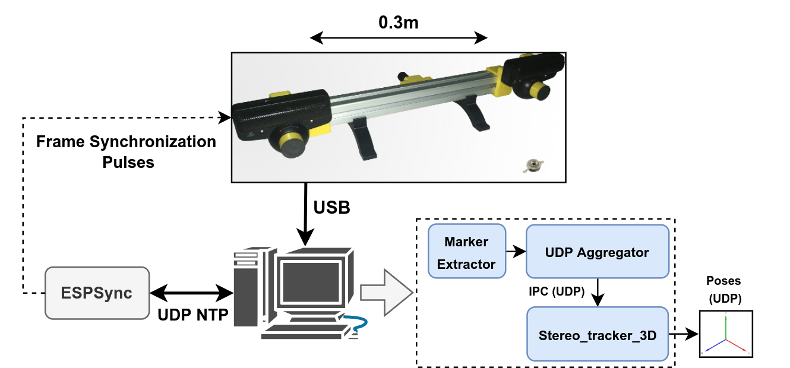
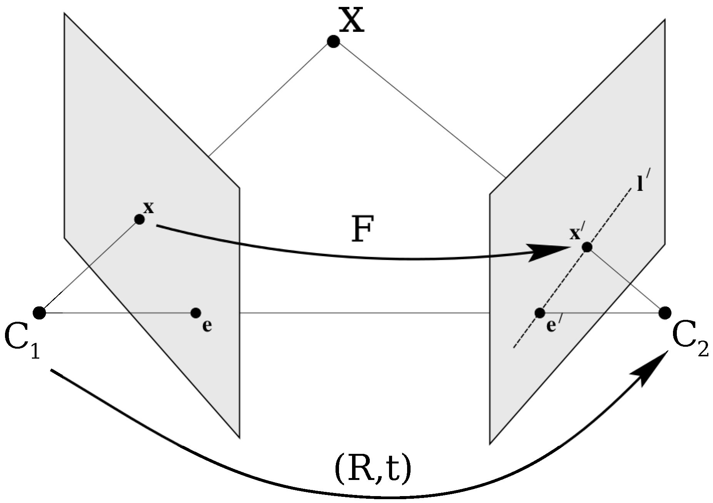
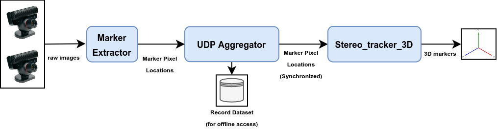

# Stereo Calibration and Tracking (3D)

This tutorial focuses on the procedure of setting up a system comprised of two cameras that observe a single IR marker from various perspectives and track its 3D position in space. 

## Setup
The camera layout of the example configuration is shown bellow. The system is comprised of two PS3-eye cameras installed on an aluminum extrusion. The two PS3-eye cameras are synchronized against each other by attaching the F-sync pulse generated by the left camera to the synchronization input of the right one. The synchronization may also be carried out through the [ESPSync project]() as described for the [multi-camera tutorial](../doc/tutorial1_multi_3d.md). 

## Calibration

Before we can track the 3D position of our robot (marker), we need to have the relative poses of the two cameras in the stereo setup. To do so, first we need to collect a calibration dataset. This dataset contains the movement of a single marker in front of the cameras at various locations and is recorded by the *udp_aggregator_node* as explained in [here](link). 

### Theory of Operation

During the calibration, we rely on the epipolar geometry between pairs of cameras to define constraining matrices and then, geometrcical transformations that define the relative configuration of the cameras with respect to each other. As shown in the following image from the [Multi-View Geometry Book](https://www.amazon.com/Multiple-View-Geometry-Computer-Vision/dp/0521540518), the epipolar constraint relates the pixel position of a marker observed from two poses (or two distinct cameras). 

This constraint is formulated in the following way:

$${x^\prime}^T F x =0$$

Where $F$ is a rank 2 $3\times3$ fundamental matrix. The fundamental matrix is related to the essential matrix $E$ as follows:

$$E = {K_1}^TFK_2$$

where $K_i$ are the camera matrices found during the [calibration and setup procedure](). The essential matrix relates the normalized pixel observations and is made up of the geometrical transformation parameters $[R|T]$ between the two cameras:

$$E = [T]_{\times}R$$

where $[.]_{\times}$ is the skew symmetric representation of a matrix as defined [here](). To decompose $R$ and $T$ from $E$ we use the following procedure:

- Compute the SVD decomposition of $E=USV^T$

- Compute $R = UWV^T$ and $T$ as the last column of $U$. 

- Triangulated the undistorted observed marker using the estimated $[R|T]$, and camera matrices $K1, K2$ to get a candidate 3D position $P$. 

- If the triangulated point is at the back of one of the cameras ($P_1^z \times P_2^z<0$ where $P1 = P, P2 = [R|T] \times P$), recompute R as $R = UW^TV^T$

- Triangulate again using the newly computed R or the old one (if the previous step was not required).If the triangulated point is at the back of the second camera ($P2<0$>), take $T$ as $T=-T$.

Using this extrinsic parameters, the camera intrinsics and the marker pixel locations as observed by the two cameras, we can reconstruct a 3D point cloud that where each point represent the position of the marker in a given point of time. It is important to note that the global scale of the computed extrinsic is not known and the generated point cloud based on it can be larger or smaller then the real physical movement. We find this scale in a post-calibration phase where we place two markers at known physical distances and compute the scale as the ratio between the observed distance and the known real counterpart. 

### Implementation

The implementation of the procedure as explained above is carried out using python and can be found in the [calibration.ipynb]() jupyter notebook. To run this notebook, you can either collect your own dataset for your specific system setup (e.x. as explained [here]()) or you can use our dataset that is provided [here]() as a sample. 

## Reconstruction
## Procedure

In theory, reconstruction requires a subset of the steps taken in the calibration step with minor modifications. Given the extrinsic parameters from the previous step and a recorded sequence of movements (e.x or a robot with the marker rigidly attached to it), we reconstruct the path of the marker as follows:

- Using the extrinsic parameters computed from the previous step, reconstruct $N$ point clouds with $N$ being to number of distinct camera pairs. 

- Take the optimized landmark positions as the final reconstructed trajectory. 

## implementation

As done for the calibration procedure, the implementation of the reconstruction steps is carried out using python and can be found in the [reconstruction.ipynb]() jupyter notebook. To run this notebook, you can either collect your own sample dataset for your specific system setup (e.x. as explained [here]()) or you can use our dataset that is provided [here]() as a sample. By default, the notebooks use the sample datasets to illustrate the procedure.

## Real-Time Tracking

The procedure is simple, we just need to run the functions in the reconstruction notebook for each observation value fed to the system in an online manner.As shown in the following image, The USB cameras are connected to the computer through the USB interface. The *marker_detector* node on the computer receives the frames from the camera and extracts the pixel locations of the observed markers in the images. 

The components of the system should be configured according to the procedure and configuration parameters explained in the corresponding node folders in the repository. Specifically, the marker tracker node should be configured to open two USB cameras (given the USB port ID). After detecting the markers from the image, their 2D locations are sent to the UDP aggregator. In this application, the UDP aggregator is not essentially needed for the functionality of the system and can be used for recording the observed data for later usage. 

The output of the UDP aggregator is then configured to send the observation data to the *stereo_tracker_3d* node. This node gets the pixel observations and uses the calibration parameters to triangulate the marker locations. Finally, the output of the node can be optionally sent to downstream nodes through inter-process connection ports based on UDP. 
