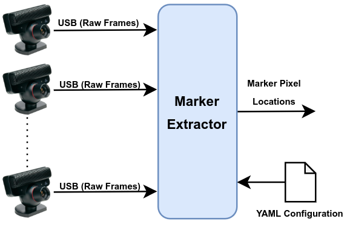
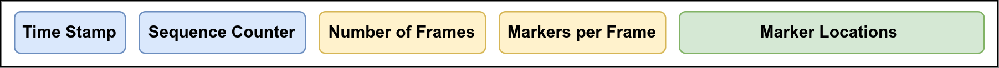
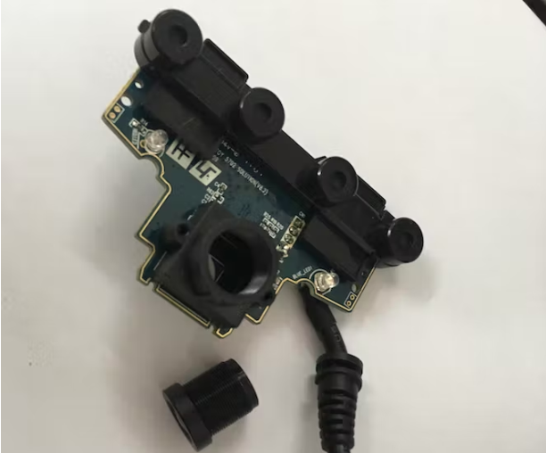
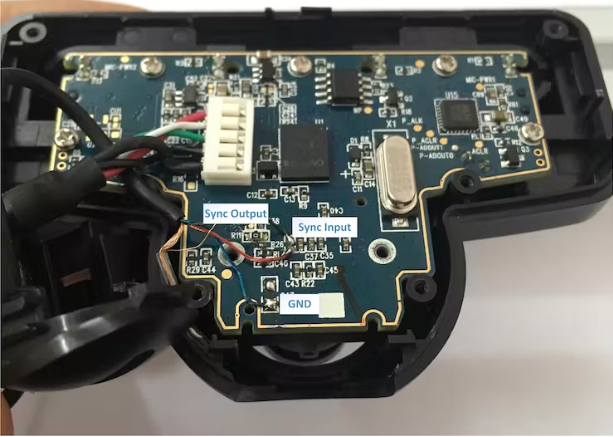
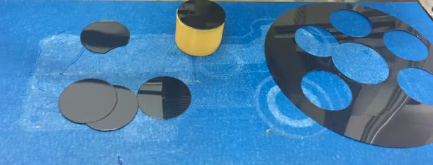

# PS3-EYE Camera Node
## Introduction

This node can connect to PS3-EYE cameras through USB interfaces and extract markers from the captured frames to be processed by downstream nodes for marker tracking. PS3-EYE cameras can capture 640x480@60FPS and 320x240@180FPS. This camera is inexpensive and most importantly, there is a [hack](https://www.hackster.io/Rooholla_kho/build-your-own-ir-tracker-system-913c2a) available for it that allows synchronizing frame capture of these cameras. 

## Node Architecture

The node can be executed on the server (where we can process the marker locations locally) or can be run on different computers which are in closer proximity to the camera hardware. As shown in the following image, the node can have several USB inputs (connect to several cameras) and one UDP output. The node is configured through YAML files that we feed to the system at the time of launching the node. 

<p align="center">
  
</p>

The resulting marker locations are sent out as UDP packets in the following format:



- **Time Stamp** The time at which the frames have been received from the cameras. Since all cameras in a group are assumed to be synchronized with each other, one stamp per group is enough.

- **Sequence Counter** An integer value that is incremented for each packet and can be used for recognizing the successions of the received packets. 

- **Number of Frames** The number of cameras attached to the node which are used to group the sequence of observations to corresponding frames. 

- **Markers Per Frame** The number of markers that are observed by each camera. It ranges from 1 to N where 1 indicates when there are zero markers available. 

- **Marker Locations** A sequence of $(x_i,y_i)$ pairs for representing all markers observed by the node. This sequence of observations is grouped and assigned to the corresponding cameras using the *Number of Frames* and *Markers Per Frame* fields in the packet.

## Node Configuration

The configuration parameters of the node are provided to it at launch time using a YAML file with the following entries:

| Configuration Entry | Description                                          |
| --------------------|----------------------------------------------------- |
| reference_by_usb    | Use USB hardware ID (true) to assign cameras or the */dev/videox* (false) ID.|
| play_from_video     | For debug purposes, we can simulate cameras by assigning video files (set to true)|
| video_files         | The list of video files each representing one of the cameras in case *play_from_video* is set to true. |
| cameras             | The list of camera IDs (*/dev/videox* if *reference_by_usb* is false and USB hardware IDs if *reference_by_usb* is true).|
| calib_files         | A list of paths to camera intrinsic YAML parameter files (form the ROS monocular camera calibration tool). Set if *apply_KD* is set to true.|
| apply_KD            | Set true if we want the *calib_files* to be used to undistort the frames before extracting marker locations. (Set to false in our setup) |
| display             | Should the observed images and detected markers be shown to the user? Set to false for headless setups.|
| print_markers       | Do we want the pixel coordinates of the detected marker to be printed in the terminal (true). |
| remote_ip           | The IP address of the server to which the node should transmit the marker locations. |
| remote_port         | The port number on the server to which the node should send detected markers. There should be one port per marker_extractor node. |
| fps                 | The required frame per second at which the cameras should capture images. In our implementation, we set the resolution to the max value of 640x480@60hz. |
| gain                | The sensor gain that determines the sensitivity of the camera to the IR light. The higher the gain, the more sensitive the camera but also the noisier the images. |
| exposure            | The exposure time of the sensor. The higher the exposure time, the higher the sensitivity but also the more motion blur effect in dynamic motions. |

**Note:** The hardware USB ID corresponding to a */dev/videox* may be identified using the v4l2-ctl tool:

Add image here

### Running the Node:

After preparing the customized configuration file, the node can be launched as follows:

```bash
python3 marker_detector.py config.yaml

```

## Hardware Preparation and Time Synchronization

By default, PS3-EYE cameras have an infrared cut filter and the frame synchronization input and outputs of the sensor chip are not exposed to the user. In order to use this camera as the base hardware for the IR tracker, the following two modifications must be performed on the camera as explained [here](https://www.hackster.io/Rooholla_kho/build-your-own-ir-tracker-system-913c2a):

- **Lens Modification** The lens should be replaced with a cc-camera night vision lens that has no infrared filters. 

<p align="center">
  
</p>

- **Exposing Synchronization Input and Outputs** The sensor chip on the camera supports frame synchronization but by default, the functionality is not exposed to the user. The user however can perform a hardware hack to gain access to those pins: 

<p align="center">
  
</p>

**Note:** Frame synchronization is not essential for applications where the marker is static or moves very slowly. 

- **Adding Visible Light Filters** To filter out all visible light and only pass through the IR rays from the markers, we use old floppy disks to make removable filters for our cameras. With this, the filter may be removed for debugging, inspection, and camera intrinsic calibration purposes and added when the system is to be used. 

<p align="center">
  
</p>

### Synchronization

In a general setting, each group of cameras in the system may be connected to an independent computer with its local clock which is used to stamp the observations. On the server computer, we receive these stamped observations and match them together. Doing so requires accurate synchronization of all local clocks against a central time reference through the NTP protocol. 

This clock synchronization may be achieved by installing the Chrony or NTP server on all computers and configuring them to listen to one of the computers as a time reference. A more accurate solution that can also provide stamped frame synchronization pulses for the cameras is to use our [ESPSync project](). With this, we can take the stamps of the synchronization pulses from the ESPSync server as the reference and match the incoming observations against those stamps.

## Intrinsic Calibration

Our system requires the lens and camera parameters to be known. These parameters may be obtained using the ROS monocular camera calibration rutile as explained [here](http://wiki.ros.org/camera_calibration/Tutorials/MonocularCalibration). The output of this stage is a YAML file that contains the camera extrinsic parameters. Sample YAML files are provided in our [sample dataset](../../multi_camera_process/sample_dataset/intrinsics).

